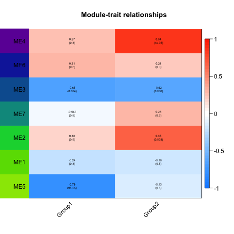

```{r setup, include=FALSE}
knitr::opts_chunk$set(echo = TRUE)
```

## Install and load required R packages
Requires: DESeq2, GO.db, WGCNA, impute and preprocessCore.
```{r, warning = FALSE, message = FALSE}
#if(!require("BiocManager", quietly = TRUE))
#  install.packages("BiocManager")
#BiocManager::install("DESeq2")
#BiocManager::install("GO.db")
#BiocManager::install("WGCNA")
#BiocManager::install("impute")
#BiocManager::install("preprocessCore")
library(DESeq2)
library(WGCNA)
library(ggplot2)
library(RColorBrewer)
library(pheatmap)
```

## Load data for Figure 6
```{r}
Metabolite_serum<-read.csv("../Data/Metabolite_serum.csv")
Blue<-read.csv("../Data/Blue.csv", head=T,stringsAsFactors = F)
Green<-read.csv("../Data/Green.csv", head=T,stringsAsFactors = F)
Purple<-read.csv("../Data/Purple.csv", head=T,stringsAsFactors = F)
vsdmat<-read.csv("../Data/vsdmat.csv", row.names = 1)
vsdmat<-as.matrix(vsdmat) #output from Figure 4 code
clusterlist<-read.csv("../Data/clusterlist.csv",row.names = 1)
clusterlist<-as.data.frame(clusterlist) #output from Figure 4 code
```

## Plotting serum metabolite matrix in Figure 6 panel (a)
```{R plot serum metabolites}
rownames(Metabolite_serum)<-Metabolite_serum$ID
Metabolite_serum<-Metabolite_serum[,-c(1:4)]

hm_color_cor<- colorRampPalette(c("blue", "white", "red"))(100)

HM_Metabolite_serum<-pheatmap(Metabolite_serum, scale = 'column', border_color = 'NA',
                         color = hm_color_cor,show_rownames = TRUE,cellwidth = 12,
                         cellheight = 12,
                         cluster_rows = FALSE, cluster_cols = TRUE,
                         angle_col =45,cutree_cols = 2)
```


## Plotting serum metabolite matrix in Figure 6 panel (b)
```{r, results='hide',fig.keep='all'}
#metabolite group data #sum of abundance 
#Plot not visible in markdown HTML file (?)
Metabolite_group<-as.data.frame(Metabolite_serum[,HM_Metabolite_serum$tree_col[['order']]])
Metabolite_group<-as.data.frame(t(Metabolite_group))
  
group<-as.data.frame(cutree(HM_Metabolite_serum$tree_col, k=2))
colnames(group)<-c('group')
#group<-group[colnames(Metabolite_group),,drop=FALSE]

Metabolite_group$group<-group$group

Metabolite_group1<-subset(Metabolite_group,Metabolite_group$group=="1")
Metabolite_group1$group<-NULL
Metabolite_group1<-as.data.frame(t(Metabolite_group1))
Metabolite_group1$Group1<-rowSums(Metabolite_group1)
Metabolite_group1<-Metabolite_group1[,c(19),drop=F]

Metabolite_group2<-subset(Metabolite_group,Metabolite_group$group=="2")
Metabolite_group2$group<-NULL
Metabolite_group2<-as.data.frame(t(Metabolite_group2))
Metabolite_group2$Group2<-rowSums(Metabolite_group2)
Metabolite_group2<-Metabolite_group2[,c(14),drop=F]

Metabolite_abundance<-as.data.frame(cbind(Metabolite_group1,Metabolite_group2))

###WGCNA######

exprsdat<-vsdmat[,c(1:19)]
exprsdat<-exprsdat[,-c(10)] #ensure the samples are matched with those from serum metabolomics
exprsdat<-as.data.frame(t(exprsdat))
##check missing values
###if result is TRUE, then all genes have passed the test
gsg = goodSamplesGenes(exprsdat, verbose = 3);
gsg$allOK

#omit unqualified gene
if (!gsg$allOK){
  # Optionally, print the gene and sample names that were removed:
  if (sum(!gsg$goodGenes)>0)
    printFlush(paste("Removing genes:", paste(names(exprsdat)[!gsg$goodGenes], collapse = ", ")));
  if (sum(!gsg$goodSamples)>0)
    printFlush(paste("Removing samples:", paste(rownames(exprsdat)[!gsg$goodSamples], collapse = ", ")));
  # Remove the offending genes and samples from the data:
  exprsdat = exprsdat[gsg$goodSamples, gsg$goodGenes]
}

TranscriptomeSamples = rownames(exprsdat)
traitRows = match(TranscriptomeSamples, rownames(Metabolite_abundance))
datTraits = Metabolite_abundance[traitRows, c(1:2)]

clusterlist2<-clusterlist[colnames(exprsdat),]
moduleColors = clusterlist2$cluster

# Define numbers of genes and samples
nGenes = ncol(exprsdat);
nSamples = nrow(exprsdat);

# Calculate eigengenes of different clusters
MEs0 = moduleEigengenes(exprsdat, moduleColors)$eigengenes
MEs = MEs0
MEs = MEs[,rev(c(5,1,2,7,3,6,4))]
moduleTraitCor = cor(MEs, datTraits, use = "p")
moduleTraitPvalue = corPvalueStudent(moduleTraitCor, nSamples)

sizeGrWindow(6,6)
# Will display correlations and their p-values
textMatrix = paste(signif(moduleTraitCor, 2), "\n(",
                   signif(moduleTraitPvalue, 1), ")", sep = "");
dim(textMatrix) = dim(moduleTraitCor)
par(mar = c(6, 8.5, 3, 3));
# Display the correlation values within a heatmap plot

png("6B_png_for_HTML.png") 
labeledHeatmap(Matrix = moduleTraitCor,
                       xLabels = names(datTraits),
                       yLabels = names(MEs),
                       ySymbols = names(MEs),
                       colorLabels = FALSE,
                       colors = blueWhiteRed(50),
                       textMatrix = textMatrix,
                       setStdMargins = FALSE,
                       cex.text = 0.5,
                       zlim = c(-1,1),
                       bg.lab.y = rev(c("#99E600","#68DC00","#00D43D","#00978C","#095E9F","#132AA9","#6D08A5")),
                       main = paste("Module-trait relationships"))
dev.off() 

```
```{r label, out.width = "85%", fig.cap = ""}

```

## Plotting serum metabolite matrix in Figure 6 panel (c)
```{R IPA analysis}
library(ggplot2)
library(RColorBrewer)

colnames(Green)<-c("cat",'logp','ratio','zscore','molecules')
Green$percent<-Green$ratio*100
Green<-Green[,-c(4:5)]
Green$clus<-rep("Green",10)

colnames(Blue)<-c("cat",'logp','ratio','zscore','molecules')
Blue$percent<-Blue$ratio*100
Blue<-Blue[,-c(4:5)]
Blue$clus<-rep("Blue",10)

colnames(Purple)<-c("cat",'logp','ratio','zscore','molecules')
Purple$percent<-Purple$ratio*100
Purple<-Purple[,-c(4:5)]
Purple$clus<-rep("Purple",10)

IPA<-rbind(Green,Blue,Purple)
IPA$clus<-factor(IPA$clus,levels=c("Green",'Blue','Purple'))

IPA_plot<-ggplot(data=IPA, aes(x=percent,y=reorder(cat,percent),color=logp,size=percent))+
  geom_point()+
  xlim(c(0,30))+
  scale_color_gradientn(colours=colorRampPalette(c("#4951a3",'red'))(20),
                        breaks=c(2,3,4,5),labels=c(2,3,4,5),limits=c(1,6))+
  facet_grid(rows=vars(clus),scales = "free_y")+
  scale_size(range = c(4,10))+
  theme_gray()+
  labs(x="Percentage enrichment(%)",y="IPA canonical pathway",color="-log (p value)",size="Percentage enrichment(%)")
IPA_plot
```

